# Nebula Ground Station UI Documentation

What is your name?
**Nebula Ground Station** serves as the final link in our broader system—an endpoint that anchors flight control, telemetry monitoring, mission planning, and video processing into one cohesive, visual interface. Built using [**PySide6**](https://doc.qt.io/qtforpython-6/gettingstarted.html#getting-started), the application adopts the aesthetic and design philosophy of [**QFluentWidget**](https://qfluentwidgets.com/), a Fluent Design System port for Qt. However, it’s worth noting that we encountered several inconsistencies when deploying QFluentWidget on Linux under PySide6. To remedy these shortcomings, we created a fork and customized it, ironing out UI bugs and enhancing Linux support. This fork can be found here: [QFluentWidgets Fork](https://github.com/amar-jay/QFluentWidgets).

The result is a native-feeling, desktop-grade UI that doesn't compromise responsiveness, beauty, or usability, even while juggling asynchronous drone data, raw video streams, and live telemetry.

---

## The Map

The **Map** section of Nebula Ground Station lies at the heart of the user interface. Its role extends far beyond simply rendering the drone’s current position—it becomes a canvas for spatial reasoning, mission composition, and real-time situational awareness.

Upon launching the map, users are greeted with dynamically updating markers that represent key entities in the operational field:

- The **current location** of the drone, updated via telemetry.
    
- The **home base**, marked for easy return-to-launch (RTL) logic.
    
- A **kamikaze drone** marker, reserved for special mission scenarios.
    
- A **target drone**, used during interception or escort missions.
    

Each of these markers plays a functional role. For instance, some commands—like auto-return or target acquisition—depend on the real-time GPS coordinates associated with these markers.

In addition to passive monitoring, the map enables **direct interactivity**. A user can manually drop a waypoint onto the map, instructing the drone to navigate toward that location. This forms the basis of our **waypoint mission system**, which allows multiple waypoints to be added sequentially, forming a mission path. These waypoints sync automatically with the **Mission Tab**, which logs them for later modification or dispatch.

This mechanism is particularly useful for structured **cargo delivery missions**, where pickup and drop-off points are predefined. More detailed reasoning and design motivation for this can be found in our [project plan](/project-plan), which outlines how this fits into the broader operational lifecycle.

The map also supports **geofencing**. This lets users draw a virtual boundary within which the drone must remain. It's especially useful for safety and regulation compliance during testing. Should the drone attempt to move beyond this fenced region, software-based checks can intervene or alert the operator.

To maintain flexibility, the user is provided with tools to **clear all markers**, **undo the last operation**, or reset the planning canvas altogether.

---

## The Tabs

### Camera Tab: Streaming, Recording, and Real-Time Processing

The **Camera Tab** represents one of the more technically challenging yet critical components of the application. It enables live video monitoring from the drone while also exposing processed footage for computer vision tasks such as object detection, landing pad identification, or terrain mapping.

The current video streaming setup is powered by **vanilla JPEG encoding**. While this may raise eyebrows due to inefficiencies compared to modern codecs like H.264 or H.265, JPEG serves a practical and time-efficient solution here. It integrates directly into `QImage`, which allows smooth rendering without requiring external decoding pipelines—an important consideration given our limited development time and need for cross-platform simplicity.

Video data is sourced from a **ZeroMQ (ZMQ)** server running on the drone’s compute node. A dedicated `DroneClient` instance, launched as a background `QThread`, is responsible for receiving and decoding this video data continuously. Even when the Camera Tab is not open, the video stream is actively fetched in the background. This ensures there's no delay when switching to the tab or when recording is initiated.

However, rendering of the video onto the GUI canvas is explicitly gated. The stream is not visualized until the user clicks “Connect” on the Camera Tab. This allows for **bandwidth control and user-triggered rendering**. When the user disconnects the video tab, we merely stop rendering—_we do not kill the thread_. This distinction is crucial: the video stream still flows in the background, and the ZMQ connection persists, since it also carries commands, telemetry, and metadata for other components.

The camera module also supports **video recording**, achieved through OpenCV. As frames are fetched, they are appended into a video stream file. Users can pause or resume the recording process at will. This makes the module versatile—suited not only for live surveillance, but also for data collection and offline debugging.

---

### Telemetry Tab: Visual Feedback for Flight Dynamics

The **Telemetry Tab** transforms raw numerical telemetry into readable, dynamic instruments. It’s the pilot’s view of the drone’s inner state.

Altitude, heading, velocity, and battery levels are all translated into visual representations:

- A **gauge cluster** displays real-time speed, height, and orientation.
    
- An **artificial horizon** helps assess pitch and roll, essential for understanding drone stability mid-flight.
    
- A **compass** and coordinate feed track heading and geographical positioning.
    

Every element on this tab updates live using data fetched asynchronously by the `DroneClient`, reflecting the real-time telemetry of the drone. The purpose is two-fold: to empower pilots with fast, readable insights, and to allow operators to detect anomalies during critical phases such as takeoff, landing, or in-flight maneuvering.

---

### Mission Tab: Planning, Control, and Autonomy

Tightly coupled with the Map is the **Mission Tab**, which allows users to inspect, edit, and dispatch mission waypoints.

Each waypoint added on the map appears in the **Mission Table**, but users can also manually add GPS coordinates here—ideal for precise flight planning, especially when copying routes from other sources or reusing predefined mission templates.

One of the most powerful features here is the **Auto Switch**. This control acts as a toggle to engage image-recognition–based stabilization. It enables the drone to **align itself over cargo targets** such as helipads or containers by using camera-based feedback. When enabled, the drone uses its vision system to gently maneuver until it is centered over the object, providing increased reliability for cargo pickup operations.

This is an early step toward full autonomy—reducing manual piloting for critical cargo handling tasks.

---

### Mission Console: Logging and Debugging

Sitting beneath the primary tabs is the **Mission Console**, a live textual logger that collates system events from across the entire application stack.

It logs:

- Commands sent to the drone
    
- Waypoint updates
    
- ZMQ communication status
    
- Camera feed status
    
- Background thread activity
    

This console was designed primarily for **developers and testers** rather than drone operators. It is intentionally verbose and sometimes cryptic. Its role is to expose the software’s inner workings and provide insight when things don’t behave as expected.

A future update will include **logs fetched directly from the drone**, completing the visibility loop between the operator and the autonomous system.

---

## The Brain: DroneClient and Connection Lifecycle

At the heart of the application lies the `DroneClient`—a PySide `QObject` subclass designed to orchestrate communication between the frontend GUI and the drone's backend stack.

This client is responsible for everything asynchronous, everything continuous, and everything that touches the drone. It performs the following roles:

- **Initializes the ZMQ client**, allowing for command dispatch and telemetry reception.
    
- **Periodically fetches status updates**, including GPS coordinates, altitude, battery, and more.
    
- **Dispatches mission control commands** such as `takeoff`, `land`, `arm`, `rtl`, etc., as direct Mavlink pass-throughs.
    
- **Controls the crane system**, sending custom commands for `pick_load`, `drop_load`, `raise_hook`, and `drop_hook`. These are transmitted over ZMQ and passed via serial to the drone’s mechanical subsystems.
    
- **Streams both raw and processed video** from the drone’s onboard camera.
    
    - These are sent as multipart ZMQ messages, tagged with identifiers like `"raw"` and `"processed"`, and decoded in a high-performance background thread.
        

By abstracting this logic into `DroneClient`, we isolate stateful communication and asynchronous complexity from the UI, maintaining code readability and separation of concerns.

Developers wishing to dive deeper can begin their exploration in [`app.py`](#), where the DroneClient lifecycle is initialized and integrated with the main application window.

---

## System Overview Diagram

To visualize how everything fits together, here is a simplified system flowchart:

```mermaid
graph TD
  UI["🖥️ Nebula Ground Station"]
  Client["⚙️ DroneClient (QObject)"]
  VideoThread["🧵 QThread: Video Fetcher"]
  ZMQ["📡 ZeroMQ Client"]
  MAVLink["🛩️ ArduPilot / MAVLink"]
  Drone["🚁 Physical Drone"]

  UI --> Client
  Client --> VideoThread
  Client --> ZMQ
  Client --> MAVLink
  ZMQ --> Drone
  MAVLink --> Drone
```

---

## Next Steps

This documentation covers the **UI and client structure** of Nebula Ground Station. For a deeper understanding of the drone-to-ground communication stack, consult the [`/comms/`](#) directory. There, you'll find detailed implementations of the **ZMQClient**, serialization strategies, and supporting modules used to integrate this interface with the airborne hardware.
